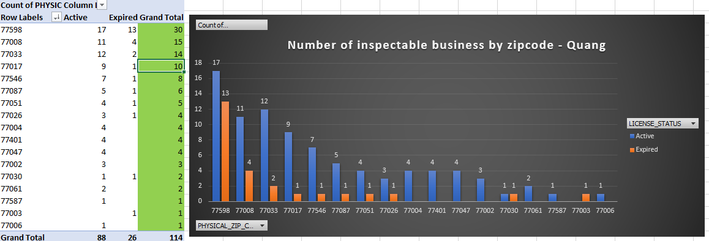
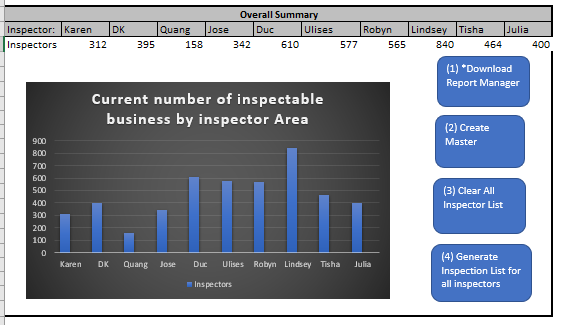

# Inspection Planner Visualizer

### Usage:
1. Inspector Import csv file containing businesses to inspect 
2. Macro will then organized and check for eligible business ready for inspection
3. Areas of inspection are split up among inspectors and ordered by priority 
4. Business are organized by location and representative as active or expired license

### Benefits:
* No longer manual sorting of raw list.
* Inspectors can visually see their progress

Will update with version 2 soon for point-to-point route planning.